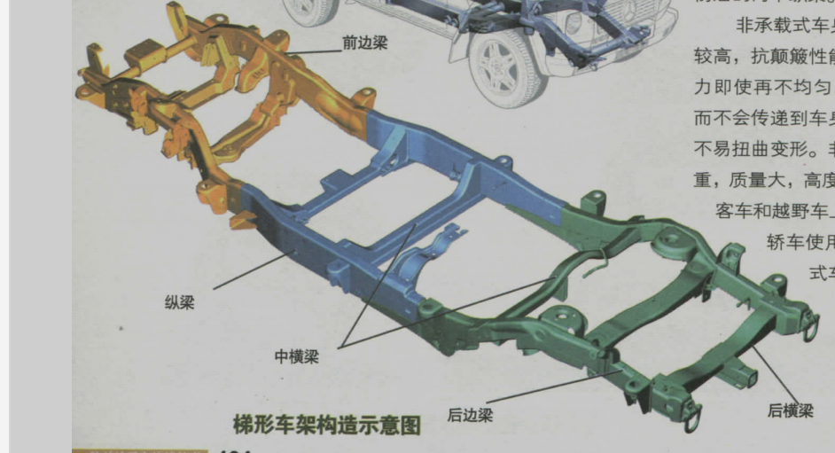
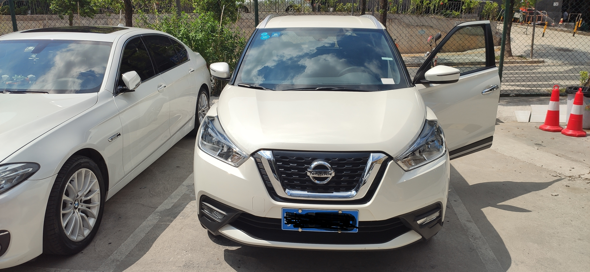

# 《汽车为什么会跑》读书笔记

## 前言

在刚出发时，我悲观的想象到，车子说不准抛锚在一个深山里，或者是没有信号的某段青藏高速上，说不准还下着暴雨。
另一方面，尽管时不时开家里的车，可我轮胎都没换过，更别说汽车构造了。
我讨厌这样不了解自己在做事情的一些内在情况的感觉的。

话说回来，该本书我不会一字一句的看，而是看我感兴趣的问题并在下面做些笔记，最后结合我在开的车子的结构做一个分析。

## 书本笔记

以下是书本的目录，由于我看的pdf是图片，我将目录ocr了出来并用python脚本整理了下顺序，所以文字和原书比起来会有些错漏。

### 前言回答您一个问题
### 导言
### 第一章整车/2
### 1汽车有多少个零部件? 12
第2页有全车的剖面，介绍了一些主要部分。并标明了介绍的页码。

一般约1万个，F1赛车约有两万个。零件多了，可靠性也会降低。

汽车主要由车身、发动机、底盘构成。
底盘则由变速器、传动系统、转向系统、悬架系统、制动系统、 车桥、车轮等部分组成。

### 2汽车有哪些主要部件? 14
### 
### 第二章发动机/6
汽车核心部分，“心脏”。

### 3汽车动力从哪里来? 1/6
### 4气缸数为何不能太多? 17
不能无限增加。零件增加，降低发动机了稳定性、提供了制造成本。

### 5 V型发动机更先进? 18
相对直列型发动机优点是尺寸小（减少的尺寸能为汽车设计、空间等提供各种好处），尤其现在比较注重空气动力学，发动机低一点越好。
缺点是两个气缸盖。

现在不少车型是V型发动机。比如，v6、v8、v12，数字代表缸数。

### 6 W型发动机为何应用少? 19
### 7水平对置发动机更有个性? /10
### 8发动机动力为何源源不断? /11
### 9发动机动力源于爆炸? /12
密闭空间燃烧产生爆炸。

### 10气缸原理来自于大炮? /12
### 11火花塞像是雷电? /13
### 12进气门为何比排气门大? /14
进气多燃烧得好。有些干脆设计多气门（3进2排）。

### 13气门数为何不能太多? /15
### 14凸轮轴起什么作用? /16
控制进气门和排气门的开关。（因为是凸轮，所以转到不同位置会带动不同动作。）

### 15为什么需要正时? /16
### 16 OHV、OHC、SOHC、DOHC是什么？
OHV：顶置气门侧置凸轮轴。
OHC：顶置凸轮轴。
SOHC：单顶置凸轮轴。
DOHC：双顶置凸轮轴。

### 17可变气门有什么好处? /18
### 18节气门起什么作用? /20
### 19进气歧管长度也可变? /20
### 20排气歧管为何奇形怪状? /21
### 21直线运动怎样变成旋转运动? 1/22
### 22活塞最辛苦? 123
### 23为何说曲轴是中心轴? 124
发动机产生的动力由活塞和连杆带动曲轴，再传递到传动系统，使车轮旋转。
曲轴的旋转也会带动分电器、发电机、凸轮轴带轮等。

### 24飞轮为何能储存动能? /25
### 25发动机如何冷却? /26
分水冷和风冷。一般都是水冷。

### 26机油是怎样润滑的? 127
曲轴的一部分动力会用在机油泵上，然后，机油留遍发动机给机械元件做润滑，
也会带走磨损的元件的金属末。所以机油最终会流经机油过滤器。
不过，汽车到了一定历程后，还是需要更换机油。

机油还有个作用是，可以一定程度的冷却发动机。

### 27发动机共有多少个部件? /28
### 28为何大排量发动机动力更强? /29
排量一般用L表示，是指气缸的活塞由底到顶扫过的气体体积。

### 29燃油缸内直喷优势何在? /31
将油（传统式将油气混合）喷入缸中，再通过均匀燃烧、分层燃烧是燃烧更充分、更准确。
据网上资料，近年不少车子使用该技术。

### 30柴油机为何不用火花塞? /32
柴油机是压缩燃烧。

### 31柴油机和汽油机有什么区别? /32
1、燃料。2、喷油方式。3、点火方式。4、油的压缩比（柴油高）。5、燃油消耗（柴油低）。
    
### 32涡轮增压如何增压? /33
简单来说，就是用废气排出时的动能来增强进气的效率。
后劲足，低速时表现一般。

### 33机械增压是什么原理? /34
### 34双增压器是什么? /35
### 35转子发动机是什么原理? /36
### 36混合动力是怎么回事? /37
有强混合动力和轻混合动力之分。

### 37氢动力汽车如何工作? /38
### 38插电式混合动力是什么? /38
### 39可变排量是怎么回事? /39

### 第三章变速器140
目前有手动自动、手自一体、双离合、无级变速等，原理差不多。

### 40汽车没有变速器会怎样? 140
变速器原理可类比变速山地车的原理。本质上是调节轮矩实现。

### 41变速器为何能变速? /41
### 42变速器有哪些种类? /41

### 43手动变速器如何变速? 142
### 44自动变速器中有两台电风扇? 144
### 45自动变速器构造有哪些? 145
### 46为何能自动变速? 147
### 47无级变速器如何实现无级? 148
利用调节主动混轮的凹槽间距来达到（金属带）带动被动滑轮的转矩变化。

### 48双离合变速器是如何动作的? 150
双离合使得能省略档位闲置时间段，使动力传递更连续。具体是双离合互为准备。
想象下图动力轴和传动轴之间的双离合的切换。

### 
### 第四章传动系统/52
### 49动力如何传递? 152
传统是扯动曲轴，让活塞在气缸来回运动而启动。现在是发电机发动。

### 50离合器有什么作用? /54

### 51万向节起什么作用? /55
位于传动轴末端。在传动轴和驱动桥、或传动轴间连接。
在前置后驱车中，要想将动力传递到后驱动桥上，由于行驶过程中，若果行驶在不平的路上，
则要在前动力轴和后驱动桥之间加上一个装置--万向节。
{{我以前以为是前后传动轴是直直的连在一起，没想到有万向节这么个聪明的装置在。}}

### 52前置前驱的特点是什么? 156
前轮驱动（front engine front wheel drive）。
特点，头重脚轻。六成以上重量在前面。

优点：
* 由于不用传动轴传递动力到后轮，成本低了。动力损耗小。所以适合小型车。
* 没有万向节，车内后排的空间多点。
* 前轮”拉着“车走，直行的稳定性高。

缺点：
* 由于头重脚轻，车尾在急速刹车时容易扬起。{{前轮驱动车坐车尾也是颠簸点}}
* 

### 53前置后驱的特点是什么? 157
前置后驱（Front engine rear wheel drive）。在轴荷上可达到50：50比例，行驶稳定性好些。

前置后驱：
* 启动和加速性能更好。
* 前轮负担轻，在紧急制动不至于车头下沉、后轮悬空。
* 由于前轮控制转向，后轮驱动，所以在转弯的时候（因为转向惯性），容易出现转向过度。

前置后驱由于以上一些特性，是目前高性能车的选择。

### 54后置后驱的特点是什么? /58
后置后驱（Rear engine rear drive）。起步和加速的性能是所有类型里最好，所以跑车一般用后置后驱。

后置后驱：
* 头重脚轻，容易造成转向过度。后轴负荷高，当超过后轮抓地力达到极限，会有甩尾现象。

### 55中置后驱的特点是什么? /59
中置后驱（middle engine rear drive）。
因为车的重量分布接近理想平衡，所以有最佳运动性能。高级跑车的主流方式。

中置后驱：
优点：
* 转向灵敏，急制动不会尾部微翘。

缺点：
* （因为中置）一般两座。
* 离发动机近，噪音大。
* 直线稳定性较差，所以（为弥补这个缺点）都是后轮比前轮尺寸大。

### 56四轮驱动有什么优势? /60
四轮驱动（Four wheel drive）。

优点：
* 比两轮车通过性强，例如，驱动轮陷泥坑里时。
* 安全性、稳定性。不容易出现打滑现象。在冰雪环境里更稳定。

缺点：
* 零件多了，成本稍微多点。
* 重量相对重了，车辆燃油增多。

### 57什么是分时四驱? /61

### 58什么是适时四驱? /62
就是由系统控制的分时四驱。
分时四驱和适时四驱都为了弥合四驱和两驱的优缺点。
适时四驱响应速度一般比分时四驱稍慢，因为适时四驱是检测到打滑了才开启。

### 59全时四驱有什么优势? /63
稳定性好。

为了解决转向干涉，全时四轮会设置一个中央差速器，使得转向时前轮快些后轮慢些。

网上找的资料：
> 转向干涉,概括说就是汽车在转向的过程中,会同时影响汽车悬架杆系的位置关系,位置关系变了,结果就是车轮相对车身有上下的位移,这就是转向过程中的运动干涉.

我的理解是，在刚转向，汽车未转向稳定前，前后轮的时速理论上是不一样(可自行想象下)。所以加入四轮速度一样会产生四轮干涉。

### 60差速器因何而生? /64

### 61差速器如何差速? /65
### 62托森差速器的原理是什么? /66
### 63为何要将差速器锁死? /68
### 64限滑差速器如何限滑? /69
### 65分动器起什么作用? 170
四驱车特有，为前后轮分配驱动力。

### 第五章悬架系统/72
悬架就是汽车的腿，车轮则是车的脚。

### 66悬架起什么作用? /72
悬架是指车轮与车身连接的部分。
形式上看，起挂车轮和支撑车身的作用。
功能上看，支撑和减震作用。

### 67独立悬架和非独立悬架怎样分? /73
简单来说，左右轮有硬轴连接则是非独立悬架，与车身相连则是独立悬架。

独立悬架可以调教出更好的舒适度和操控性。

### 68什么是麦弗逊式悬架? 174
### 69双叉臂式悬架什么样? /75
### 70纵臂扭转梁是什么形式? 176
### 71稳定杆有什么作用? 177
### 72多连杆悬架最先进? 1/78
### 73空气悬架的好处是什么? /80
空气悬架是指采用空气避震器的悬架。区别于传统避震器（采用油液）。

空气避震器由于可以调节避震器中空气量，这就是我们在一些车上可以看到车身升降的原因。所以：
优点：
* 颠簸路段可以变软，高速变硬。可通过电脑或电子系统调节空气量，更适应不同路况。
* 在车辆不同载重下自动调节保持车身高度。

### 74有了弹簧为何还要减振器? /82
弹簧在复原时，会出现震摆现象。就是说，弹簧受力并复原到平很状态前会出现多次上下跳动，
车呈现不稳定状态，这无论对驾驶或者乘坐都是不利的。液力减震器有抑制这种现象的作用。

### 75电磁减振器有什么优势? /83
新型减震器。原理简单来说，
在减震器中会存在特殊液体，能够通过线圈和系统调节减震器中磁场大小，从而影响液体中分子排列，
达到不同的阻尼系数的，从而达到调节减震能力的作用。

### 
### 第六章转向系统/84

### 76随速助力转向有什么好处? /84
传统转动系统，在低速时轻盈，在高速时轻飘。
随速助力转向能够感知车速，并调节力量，使得低速时转向轻盈舒适，高速时稳定。

### 77转向为何需要助力? /84
是指借助外力减轻操作方向盘的费力程度。
根据主力来源不同分为液力转向和电动转向。

### 78什么是齿轮齿条式转向? /85
转向机构分两种，
* 齿轮齿条式（一般的轿车用这种）
* 循环球式

### 79什么是循环球式转向? /85
### 80主动转向系统有什么优势? /86
能够根据车速调节齿轮和齿条比例的装置。
比如，在30公里/小时车速，方向盘转动10度角，车轮转动1度角。而在车速为120公里/小时时，方向盘转动为20度，车轮才转动1度。

这样增强了车辆稳定性。

### 81可变齿比转向有什么优势? /87
### 82四轮转向如何动作? /88
四轮转向的工作原理如下图。可使车辆驾驶或乘坐体验更好。比如宝马七系就是采用4轮转向。

### 第七章制动系统/90

### 83盘式制动性能更好? /90
按制动形式分为：
* 盘式制动
  
  构造简单，轻便，散热快。
   
* 鼓式制动

  成本低，制动片磨损少。目前仍会在经济型轿车后轮采用。
  
  一般轿车的手刹都是采用鼓式制动对后轮制动。所以漂移时，为了让后轮滑动一般要拉手刹。

btw，了解了下漂移，这个回答从物理原理到什么条件车可以漂移到实战视频比较全面。
[自动挡的车能漂移吗？ - 无往的回答 - 知乎](https://www.zhihu.com/question/20973554/answer/26131504)

### 84为什么称鼓式制动? /90
### 85制动盘为何要通风? /91
由于制动系统是通过摩擦力将动能转化为热能。
所以通风（或者说扇热效率高）有利于转化。

### 86陶瓷制动盘有什么优点? /92

* 重量轻
* 摩擦系数高
* 比铁制的耐用

缺点：
* 成本高

### 87紧急制动辅助系统有什么作用? /93
发现驾驶人迅速制动，可提供更大的力量去制动。能更有效应对道路上的紧急事件。
### 
### 第八章电气系统/94
### 88CAN- BUS总线是什么? /94
CAN总线，可靠性高，最早用于一些飞机、坦克的电子系统通讯上。
现在广泛使用在电子自动化、电子医疗设备、工业设备等上面。汽车会用在各传感器的数据传递上。

下面是网上找到的一些介绍资料。第2篇有从网络通信，通信工程的视角介绍can总线。

[1][can总线|百度百科](https://baike.baidu.com/item/CAN%E6%80%BB%E7%BA%BF)

[2][一口气从零读懂CAN总线|知乎](https://zhuanlan.zhihu.com/p/32221140)

### 89电子稳定程序ESP如何介入? /95

### 90随动转向前照灯有什么好处? /96
### 91LED车灯为何寿命长? /97
### 92空调为何能制冷? /98
### 93主动头枕如何动作? /99
### 94电动座椅如何调整和加热? /99
### 95安全气囊什么时候才会启爆? /100
看安全气囊的碰撞传感器的设置。

### 96折叠顶篷如何开关? /101

### 第九章车身构造/102
### 97汽车如何分“厢”? /102 
### 98车身规格如何标注? /103

### 99什么是非承载式车身? /104
非承载式车身就是有车架的车身结构。发动机、悬架、传动都固定到车架上。特点是，平稳性、安全性强。

### 100什么是承载式车身? /105
承载式车身就没车架，悬架直接连在车身上，整个车身一体，没有说固定到车架这一说法。

### 101车身为何要采用不同的材料? /106
不是说金属强度越高对于驾驶人和乘客就越安全。比如车头和车尾某些地方强度弱些可以在发生撞击时吸收撞击（不然发生撞击可能车子弹的远远的）。
当然驾驶室部分是要强度高的。

{{我的延伸想法，所以有时新闻看一些好车撞烂了，未必就是造工差}}

### 102车门防撞钢梁起什么作用? /107
### 103什么是溃缩吸能车身? /108
### 104什么是冲力转移设计? /109
车身的金属结构设计，能巧妙的分散撞击。

### 105自动防滚杆如何动作? /110
### 106汽车行驶时为何会产生升力? /111
### 107两厢车为何都要装后刮水器? /112
两厢车后窗更容易染上灰尘。

### 108空气对汽车必不可少? /112
### 
### 第十章设计与制造/102
### 109为何先从草图开始? /114
### 110效果图是什么样? /115
### 111为什么要做1:5油泥模型? /116
### 112 1:1油泥模型怎样做? /116
### 113样车都做哪些试验? /118
### 114汽车是如何制造的? /120
车身冲压、车身焊装、车身涂装、整车总装。

### 后记/122

## 车子分析

下面我对车子的组成进行了分析。
(漏了底盘图片，进藏前在香格里拉一家房东介绍的4S店做了检修，当时把车挂起来看了下底盘，可是我没拍照)

车头各部分：

前轮悬架：

车子参数：

劲客整体来说在这个价位中规中矩。
驾驶体验舒适度还行，在高原上的油门后劲不足。
前置前驱，承载式车身，麦弗逊式独立悬架，车体没做什么加固。
那就决定了车子不是走运动型和越野型路线的。
实际驾驶上，油门平均，减震调节一般。

各部分硬件分析完，通过这些分析，加上实际行车的经验，可以帮助我们在行车时，
知道车子各部分发挥的作用，更熟知车子能适应哪些路况，在什么时候是有不足的。

### 驾驶准备

开车前购买国内旅游保险，把单号告诉亲人。（不贵，几十块钱）

检查车灯制动，车上备用胎、灭火筒等工具。

进藏前，最好找一家店检车，师傅会检查下底盘，悬架，各部分是否夯实完好。
胎压2.5就好，我一开始觉得车开起来车胎不够气，可师傅检查后说还需要放点气。
原来上了高原由于气压低，车胎会涨容易爆胎，所以胎压不要太高。

刮玻璃的水用玻璃水更好些，一方面，路上很多飞虫会撞在车窗上，用普通自来水是清不干净的。另一方面，在零度下，玻璃水有更低的结冰点，不容易结冰。

我自己的开车规则是：
* 第一原则，保证安全。
* 如果有乘客的话，考虑舒适度。
* 考虑对车的伤害程度。

从安全角度展开，
* 尽量不要晚上开车。川藏、青藏公路晚上都是没灯的，也没什么反光设施，护栏设置存在不少不合理不少没有的情况。
  晚上经常走神，我在若尔盖那晚开车就是用经验和本能开车，回想起来挺不好的，时不时眼皮一垂车头扭到一边，然后一个激灵醒过来又把车头矫正。
* 冰雪天开车注意路面会结冰（雪在地上融成水又结成冰）。
* 视野差的双向单车道的山道注意转向按喇叭。
* 落石路段注意躲避地上石头，还有车速不宜太快，看清楚有没落石在掉。  
  我看到的，比拳头稍大的一颗石在高空掉下来就可以在车顶砸一个大坑。
* 下大暴雨就别走了，因为有泥石流。
