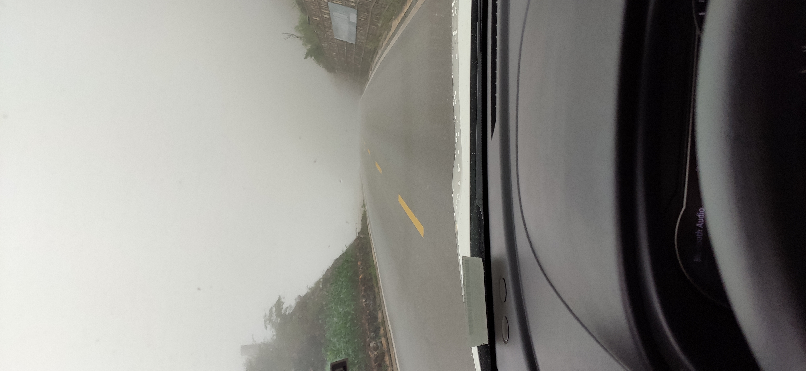

# 行程流水账

day1

深圳->南宁
7百多公里，过路费接近4百，
经过顺德，肇庆，云浮，岑溪，玉林，贵港。

南宁核心区划分有点特别，比如我住的青秀区(我住在在南湖公园旁)从地图上看呈现一长条型
最兴旺的，据酒店前台说是兴宁区，最推荐游玩的是朝阳广场和中山路，城市建设很好的，路宽。

day2

南宁市区行走

坐地铁去了朝阳广场玩，认识了位小姐姐，她介绍我走三街五巷。印象很深的一点，我漫步朝阳广场一带街道，在目之可视处总能看到有眼镜店。南宁的大路不少，人行道也宽，我估摸着，这几年南宁应该飞速发展，因为感觉南宁建筑风格断层比较明显。

下午启程去云南昆明，堪称精神最疲劳的旅程之一了，路上走了起码14个小时(那时对走7，8百公里的耗时还没什么概念)，凌晨5点才到，而且超速的时间不少，从这段开始我定了个旅途原则，绝不疲劳驾驶。晚上行车会很多虫子撞在车上。途中耳朵嗡嗡，查了高德地图才知道已经到达贵州，而云南贵州在云贵高原上。这边的晚上凉爽，需要穿两件衣服。
走汕昆高速，途中还经过一小段贵州。汕昆高速说实话有不少我觉得不合理的限速规定，不少限80的，还有些三车道限60的，就在这里整个旅途我的车速开始比我以往开车快起来了，而且一去不复返了，现在我回家开车车上载人会开的相对慢，可是比较不习惯开慢车了。
最后住在呈贡区云南南站，云南大学那边。

day3 7月23日

睡醒已经下午，和酒店工作的小姐姐聊了半小时，她是一位昆明当地人，她介绍起西双版纳，还有她刚去完的虎跳峡，泸沽湖，丽江古城等等，给照片给我看，我被她的热情感染了，可惜她因为工作关系不能和我去西藏，然后，还给我讲怎么小心吃菌，说了下次来一起去西双版纳，末了我说要逛滇池，她推介捞鱼河湿地公园。去到捞鱼河湿地公园(据说还可以捞鱼)，那里可以游玩昆明滇池(人不多，景色还挺开阔的)。进入昆明市区，停车在五华区的恒隆广场，坐地铁到五一路，然后走南屏步行街。
吃了一家大众点评的排第一位的云南米线。还挺香，花瓣飘飘，各种的菌。

day4

在呈贡区的各大学校区走了圈，已经有零星的学生在活动，可惜的是，都不让校外人士进去。有意思的是，在这里能闻到青草味，路边的绿植千奇百趣各色各样，与广东这边的千遍一律比起来，显得格外让我印象深刻。大概是昆明四季如春的关系吧，我想。
在那边晚上有一大片小吃档。
我在大众点评上找了排名前三的饭店。吃的是当地特色傣族的手抓饭。说实话，卖相不错，并不好吃。用荷叶垫底，有各色不同菜色盛在上面，两种酱，两种饭，当时有问服务员都是些什么，转身都忘了。我记得那家店楼下就是延绵一条街的小商贩，响应国家的地摊经济号召吧。

day5 7月25日 昆明->大理->丽江

走杭瑞高速转大丽高速。到达大理的双廊古镇后沿着洱海逛，逛到日落才出发去丽江。大理游人极多，随处可见一些我认为是浪漫主义的特色。挂着大理车牌的粉红的甲壳虫、宝马2系、各色跑车，数个陈列着透明摇篮、阶梯等等的网红拍照地点，静待开业的酒吧，一对对情侣，飘扬的长裙，一顶顶草帽，一路上欢声笑语。看着洱海，似乎这么与世无争，似乎这么慢节奏，似乎这么心旷神怡。
在停车场上厕所时，纳闷于停车场的厕所竟然要收费，怀着些许不忿去扫码缴费时，停车场的两位大爷，一位是外地来的壮壮的，一位是附近村的瘦瘦的，自顾自地给我科普起这边的游玩设施。虽然我不在大理停留，但是乐于听他们的介绍。
那位本地的大爷操着一口很不流利的普通话，和他对话很多字眼需要重复猜测。
他说他们的停车场在半山上，看日落还不错，不过因为雨季，云多得没边。接着，跟我聊起吃菌，爬山。
我问他这边哪里可以看日出。他突然异样兴奋，跟我说古城的日出一般，然后跟我说起他跟朋友前些天在鸡足山看日出的行程。他说，那里看日出好看，而且下山时云雾弥漫仿若仙境，下到山底，因为当季，有很多菌子卖，买点什么什么菌然后用辣椒炒，贼香。
大叔很多段落还重复了两次说，可以看出来他是发自内心的推荐。如果下次有机会再来云南，我一定会去一趟鸡足山，我想。

收拾心情，背着月光沿大丽高速去往丽江。
订的丽江的客栈是路上应该是唯二的会提前打电话跟客人了解行程，并且主动打点一二的酒店。到达已经晚上11点了，匆匆行走了下丽江古城，一路进去，店铺大多关门了。我按着地图走到有小河的边上，想看下夜景，不负所望，我沿着高德地图走到一处小溪边上，沿河灯火灿烂，小桥流水，还有不少匆匆离去的游人和在酒吧里畅饮的客人。
十二点多，从丽江古城归去。
回去应酒店前台的邀请，到顶楼喝酒玩游戏。前台有一位很能喝的，人称亮亮，第二位是一位当义工的女孩，很豪爽，忘记名字了。。
上楼，还没到楼顶已经听到欢声笑语（记得隔天因为太吵被投诉了），走到顶楼真的有点豁然开朗的感觉。顶楼挺大，一整片花园，远处是一个玻璃盖成的房子，里面放慢健身器材，近处是一处木庭院，男男女女跻身其中玩游戏喝酒。
打了声招呼，我也参与进去了。
玩了好多游戏，喝了不少。喝到接近4点，大伙撮合了一对男女，我们也识趣地把顶楼让给他们，各自下楼了。或许丽江果真是艳遇之城吧，席间我还听说一些故事，包括席上的一对情侣后来才知道是前些天在酒吧好上的。
下楼觉得肚子饿了，撞上亮亮，一起出去撸串了。

就咱们和撸串摊的夫妻做一桌吃喝起来了。因为亮亮刚去完西藏，而我准备进藏，不自觉的就亲切起来。亮亮原来是酒店的老板之一，因为疫情酒店从11家亏成了一家，还挂着官司。疫情令丽江从旺季时人挤人变成了空城，大家都不胜感慨。
席间他们聊起丽江的酒店业的变迁、钓鱼趣事、亮亮从小在山东的混子经历、还有他们见识到的旧时警察局的制度的趣事、还有西藏的凶险和注意事项。我饶有兴致的听着，一直到5点多6点天快亮才散去。

day6
丽江->泸沽湖
起床已经中午了，下起了雨，我先去丽江古城玩一趟。回来时遇到滂沱大雨，客栈老板煮起了姜汤，为每位进门的客人呈上一碗，多么贴心呀。很多细节都做得很好。(他们用优秀的品质生生打破地段为王的规律，在后来我在网上看，他们都是首先租满的)

迎着雨出发去泸沽湖。300多公里路要走5个小时。

走丽宁公路，经过丽江市宁蒗彝族自治县，再走宁泸公路。

丽宁公路盘旋在重山之中，因为下着雨，一路上落石很多，雾也不小。

有发生意外的停在一旁等待救援的车子，也有很多挡路的石子。虽然昨晚才被亮亮科普过一些路上险情，但是我有点无知者无畏的感觉，就这样前进着。

翻过一座座山，在某座山上的休息区，可以一览金沙江。

再过几座山，到了宁蒗彝族自治县。
这里好像进了另一个世界，路上有牛拉着车，他们的出租车是绿色小面包车，一路上都是家长和孩子们，好不热闹，看起来是有什么大考试刚刚考完出来
（后来网上查了下7月25-27是云南的中考）。建筑是和平常看到的不一样，红红黄黄的，风格和藏族建筑接近。

又行走了一百公里路，穿过一个长隧道，终于到达泸沽湖，看了下海拔2600多。只有我和另一台车。办好入住，刚好酒店在泸沽湖边上，泸沽湖的水真的清澈见底。

btw，住在泸沽湖畔的摩梭族是世界上仅存的母系社会。

day7

泸沽湖->丽江

泸沽湖坐船，水很清，看到水性杨花（一般7月开个一两周）。同船有一位小哥刚买了个防水手机，真还给放水下拍照了。
可以拍出一半天一半水底的照片，怪有意思了。

上岸后，开着车沿着泸沽湖公路逛了一圈。导航报着“您已进入四川省”，才发现泸沽湖有2分之3的在四川界里。
沿途的格姆女神山由于缆车整修的关系上不去。

day8

丽江->香格里拉

从丽江主要沿着214国道开往香格里拉。在去香格里拉路途上，比较懵懂（当时还不知独克宗古城、普达措等），只是抱着走到哪是哪的心态开车。
经过虎跳峡，因为里面公路塌了在整修，重新开放时间未定。继续北上。

走进香格里拉市区，仿佛进入了另一个世界。

藏族气息扑面而来，连加油站、公交站等都以藏族的特色而建。藏族典型的建筑特点，碉楼模样，四四方方的，白刷刷的墙从地上到楼顶稍微呈斜向上，窗户是枪口檐，
窗框上沿会附上藏族特有彩绘。
还有一个香格里拉特色现象，在我刚进城驾驶在一个两车道的路上，堵上车了，我心想:疫情期间也这么多游客吗，没道理呀。
经过一段走走停停后才发现快车道上一群羊甩着尾巴走着。然后一堆司机骂骂咧咧的从慢车道通过。（后记，后来在藏区时不时发生）

住在独克宗古城边上。因为疫情原因，生意冷清，房东已经回上海休息一阵子了，带我进酒店的是一位温柔的热情的义工小伙。
门口停着jeep牧马人，是我热爱的车子，车子贴着xx会的标识，看得出来房东一家子是喜爱野外旅行的。他跟我说房东忘了从网上下掉酒店，而我可以独享整栋别墅。

晚上在独克宗古城的月亮广场一般会有小数民族在载歌载舞。独克宗古城依山而建，沿着山间商街走。与丽江古城比起来，这里显得人烟稀小，
店铺也关了不少，建筑这边显得大气些（丽江则温婉些许）。踩着凹凸的石板路，依靠依稀的接囧的一家家店家门口挂的灯笼光，一路上山。

山上是大佛寺，在那可以一览香格里拉的夜景。并且那里有世界上最大的转经筒，顺时针转三圈，寓意保佑一年平安。

day9 香格里拉游

普达措国家湿地公园，在3、4千海拔上，有很多国家级的保护生物。碧塔海和文化村因为保育原因不开放。比较印象深刻的是，在属都湖边上的山，由于海拔的
高低的关系，同一座山，可以看到在3000-4000海拔是由低望上生长着亚高山草甸、落叶阔叶林、真阔叶混交林、寒温性针叶林，4000-4300海拔仗着高寒灌丛草甸。
因此，我们可以看到那片山一层层往上环绕着不一样的色彩。

噶丹·松赞林寺，还没下景区公交就看到宏伟的寺庙上面有好多黑色的东西，定睛一看才发现是很大只的鹰，或盘旋在寺庙上空，或停留在寺庙的屋檐上。
我偷偷的跟着一个旅行团（蹭了一波解说，哈哈），沿着八大康参，上到上面的寺，游览了一圈。游览藏传佛教寺庙是要求尽量不走回头路的。

day10 纳帕海草原

略。

day11 休息适应高原

因为一路听说进藏路途的困难，所以在香格里拉适应下高原，顺便整理出接下来的日程路线规划。

香格里拉的很多快餐店都很好吃，可以吃到以往比较少见的黑猪肉，牦牛肉等等，饭呀粉呀都挺好吃的。比起我尝到的大众点评前几名的火锅店，我个人是更推荐这些寻常小店。
有一家是过来开店的丽江的老奶奶，她跟我说今年四月才融雪，一般9-10月就下雪，全年最高气温不会超过25度。
有一家老板是大理人，他跟我介绍起菌子，松茸价格，如何挑选，什么是品质好的等等。
类似这篇[简书 | 教你如何快速区分松茸等级](https://www.jianshu.com/p/e110fb843f17)

在向阳路农贸市场里逛了下他们的街市，卖的也是寻常菜肉。买了些水果回去吃。
（后记：必须尝下他们的水果，都超好吃，他们的芒果，吃起来甜而且有一股花香（我的天！）。大概是高原地区日夜温差大的关系吧，我想。）

去到松茸交易市场（人好多）买了些松茸寄回家。我发现松茸市场都是以长度来区分售卖。（其实是否开伞，菌身是否紧实也重要）

day12 8月1日进藏，巴拉格宗大峡谷->迪庆藏族自治州德钦县->飞来寺

走g214国道，迪庆-巴拉格宗，属于川藏滇交界处，峡谷、高山栈道、巴拉村都觉得挺好看的(超出预期)。
斯那定珠的故事很鼓舞人。想认识下斯那定珠老先生，遗憾是他们说他不在村里头。

飞来寺-梅里雪山
基本延214到飞来寺，沿路山路险峻，弯路多，车速不要太快，我前两天冷到有点小鼻涕感冒，开车时，鼻子都是塞住的，用嘴呼吸也有点辛苦，看来进藏尽可能避免感冒是真的。
从这里开始酒店的质量开始下降。
在迪庆藏族自治州的德钦县里，物价贵，吃饭贵，据其中一个饭店老板说，食物都是从香格里拉运过来的，一个盖饭，香格里拉15、20、25不等都吃过，而
日照金山，因为云没看着，据酒店前台说，因为现在雨季，7月份只看到过一次。

day13

g214飞来寺下山途径澜沧江，有个位置可以走下公路在江边上看(真的边边，可以站在边上石头上，澜沧江磅礴的水会溅到手上)，相机拍不出它的磅礴，比不少景点还好看

经过芒康盐井，走过红拉山口。

芒康到左贡的路上有一段阔然开朗的山景，山很美，山都布满了绿绿的草，山谷上有高压线穿行，这里的景色让我感受到祖国山河的壮丽，发现为什么318叫中国景观大道。

19点
到达左贡

左贡有新城区和老城区，新城区比较时髦，KTV，酒吧等都有。

day14
经过邦达，走过七十二柺，走到业拉山口，不知不觉上了5千海拔，业拉山山的峡谷很险也很笔直壮丽，下面流着泥红色的怒江水。

出了峡谷吃个饭，老板娘是成都人，这边很多川渝的人。

沿着山谷走，山谷下是绿绿的流水，最后到达然乌湖，看到然乌湖的水是泥黄色的。
加油站的本地人跟我说，一般3～4月化冰了然乌湖的水才会绿，现在雨季，山上的水带着土流下来。
后来我再找在酒店工作的本地人，他跟我说，去湿地那里(一些人在那露营)可以看到绿色的湖水，的确，虽然，过程中我趟了趟水，鞋子都湿了，不过很值得，行走在绿绿的草原上，有蓝绿色的湖水穿插其中，还有远处残存着一些些雪的两座雪山美极了。还碰到了八一假期而露营的军兵小伙，感谢他的指路。

一路上，牛漫山漫公路的走，我很好奇村民们是用什么分出哪头牛是自家的。我问了一位藏民奶奶，她说，牛出生自自家，就都认得出模样来，有意思。

day15

从然乌镇启程，本想去来古冰川走一转，可是启程后堵在了318，559国道的分叉口了，而且走上前问警察大哥说，左边的隧道修路，而右边又是一直在修路，已经堵着不动3，4个小时了。我性子急了，就没去世界三大冰川之一来古冰川了，直接走318去下个景点。
直接缩短一天行程，去林芝了。

途径鲁朗林海，很好看。都是像松树一样的树木，布满山林。途中有幸看到几步一拜的朝圣者。

最后，住在藏粤共同打造的酒店区旁的村子里，里面是土生土长的村民，他们的建筑风格也是一路看到的藏式，他们的文化保存的很好。
我问他们为什么是枪口檐，他们说是为了美观。遇到一个有点主动想示好的一个人去阿里的广东女孩，可是又是冷淡回应了。唉。

day16

色季拉山，问了一位老奶奶，他说在和他的儿子转山。藏族挂的经文(叫经幡)布寓意一帆风顺，他们有一个藏历，会看什么时候挂是好时候。
老奶奶还教我最万能的藏人语句：扎西德勒。

看过尼羊河就直接上林拉公路，一路上看到尼洋河，很多山，还有拉萨河。中途没进西藏唯一5A景点。
到拉萨住在城关区的一个村里，八廓街晚上8点后不开，碰门钉了。不过八廓街周边有些街道(比如北京东路)挺繁华，直到大概22点才陆续关门。

day17 羊湖

羊湖（羊卓雍措）是一个比天还蓝(天蓝色)的湖，海拔在4千多。上羊湖的路挺陡峭的，而且一路限速40，开得难受。

day18 布达拉宫，八廓街

早上去吃藏面馆，点了藏面（附送酸萝卜）和甜茶。按照一位在拉萨工作的女孩说，藏族很多人早餐吃这些。

下午3点布达拉宫(需要提前一天预约)，布达拉宫附近很难找停车的地方。

据某向导说，布达拉宫的镇馆之宝是那尊自然风化而成的菩萨像。
印象最深的是，在红宫的五世达赖哪嘛的灵塔，是最大的灵塔，塔越大说明功绩越大。塔里有他的肉身，塔周环绕镶嵌着玉玛瑙。塔前有一个象髓珠(大象的脑髓)。

走上布达拉宫，由于海拔高的关系，小腿前面的肌肉第一次感觉很酸。

接着走了下布达拉宫广场和八廓街。

day19 八廓街，大昭寺

逛了下八廓街。然后排队进大昭寺，17点半关门。大昭寺就在八廓街中。
大昭寺始建于公元7世纪，由松赞干布所建。镇寺之宝是一个释迦牟尼8岁等身像。
有铁链封锁着门口，只能远看。我问了两个向导他们说铁链平常都是锁着的，可在参观途中我看到有保安解开铁链带着一对妻子进去参观。

坐公交回去（我喜欢坐下每个城市的公共交通），体验没什么区别。

day20 色拉寺，拉萨街头

拉萨街头没怎么发现共享单车，反而是有不少共享电动车。我觉得共享电动车（或助力车）比单车实用很多。
骑着电动车穿梭在拉萨城关区街头，有点冷，高原地区出不出太阳温度差别大。

色拉寺对我来说算是相对原生态的景区。为什么呢，因为色拉寺没有安检，没有温度测量，没有导游。它就是它的样子，
里面有僧在洗衣服，有并不太新的设施（相对布达拉宫）。

在色拉寺外面的街上步行，走进一家藏族茶馆（拉萨到处都有开）。我开始习惯每次进门点一小壶甜茶（一磅）。

在香格里拉那边饭馆都是酥油茶，而拉萨则基本是甜茶。我好奇了解了下两者区别。
酥油茶是历史悠久的。起源于西藏，能驱寒充饥（个人觉得有点腻）。用酥油（牛羊奶中提炼的油脂）、砖茶、食用盐（近些年出现了加糖的）加工而成。
甜茶是上世纪初从印度、尼泊尔传入西藏的。用红茶、牛奶、白糖调制成。个人还挺喜欢。我看到的是，拉萨当地人去的茶馆只有甜茶，没发现有供应酥油茶的馆子。

day21 纳木错 那曲

踏上出藏路途，沿堆龙大道进g109国道，朝着纳木错进发。

经过念青唐古拉山。发现当雄在举行赛马节，围观了一波。用了3个小时50分到了纳木错的售票处。车堵上了，与一位武警和一位大叔聊天，原来是一位常委级的官员在
纳木错里面，武警大哥不愿意说是哪位常委。
等了接近两小时进去。

进纳木错的山路很陡峭，上到上面就是平原一般，看了下手机大概4700+海拔，长长的公路一望望不到头，一直到雪山那边。
纳木错的水很清澈，天特别蓝。会看到海鸟在飞。

出纳木错。由于不想早点出青藏高原，
所以晚上不在当雄停留，直奔那曲。

在回到当雄的下坡路中（4700到4200海拔），天下起了滂沱大雨，漫天的水雾挡住了下山的视线，一路上的司机大哥心照不宣的打起了应急车灯，
维持在50公里左右的车速下坡。
到当雄天已经快黑了，雨一直下，那一晚我顶着黑夜硬是开到了那曲。那曲的晚上温度2-3度。
如果以后有人问我注意事项，我一定跟他说别晚上走青藏线。因为，没有路灯，没有反光设施，
很多地方没有护栏，有的只是地上的白线。一走神说不定就冲下悬崖。

说说青藏线吧，客观来讲，青藏线是路况比较差的路，延绵起码几十公里的炮弹坑，而且大家都比较急着出藏。
记忆中路上看到车撞车三起交通事故，好多车发生状况的（翻车、冲到坑里出不来等），
还有一起事故是看到救护车把人抬走的。经过哪些炮弹坑的洗礼，我的车的左前胎被我磕了一个包，
轮毂弯了。。

不过好消息是，我看到沿途的京藏高速修的差不多了，看网上新闻说是年底可以通车。

day22 那曲->沱沱河

本觉得我在西藏已经适应高原了，可是，昨晚我鼻子堵住了呼吸不畅（有可能是暖气引起）而且头有点晕，且大概只睡了3小时，睡到4点醒了。感觉3、4千海拔和接近5000的海拔还是有点区别。

吃完早餐，本想从那曲直接到格尔木，不曾想遇到两次交通管制要修路。途中还下了几场雨，高原下雨，远处看就像是天与地间挂起了一帘帘纱帘一般。

最终停留在沱沱河，沱沱河是长江源之一。这里有一家兰州牛肉面，面条口感非常好。

day23 沱沱河->格尔木市

今天出发往格尔木市。今天要穿过“人类生命的禁区”可可西里无人区，前几天新闻说有人在可可西里轻生。

走到可可西里肚子很痛，我找到一位修路施工队的大爷，问他厕所在哪，他说，在可可西里到处都是厕所。我两相视一笑。
想着再过一百公里也还出不了可可西里，于是我怀着敬畏之心在可可西里拉了一坨的屎，嗯，金黄色的，还挺健康，哈哈。
就当做给那些草做肥料吧，我安慰自己道。

穿过可可西里，踏上昆仑山。踏进了一片泥土的世界。

到达格尔木市，
一位刚下班的女孩介绍我吃了比较地道的手抓(牛肉)和面片，喝了伏茶(据老板说只有青海甘肃有，可是和我在拉萨喝到的口感挺像，滑)。

格尔木比较繁华的荣盛步行街逛了一圈，感觉是一个小城镇的感觉，挺热闹，有不同民族的人在摆着摊，
有些还顺便做着直播带货。还到一歌舞厅看了看。

感觉格尔木的路的建设(也包括其他基础建设)的还是相对可以的。
 
和一位卖东西的大爷聊到，格尔木人流多的地方是体育场，还有荣盛步行街一带，格尔木的夜生活一般到一点，这可能和高海拔地区天黑的晚有关。
确实到十二点多街上人络绎不绝。

day24 格尔木->西宁

经过柴达木戈壁滩，去了茶卡盐湖(现在回想来，别买套票只是单买门票走进去就好，浙江人的话，去茶卡盐湖免票)和青海湖，晚上到达西宁。

行驶在柴达木戈壁滩的高速上，一辆车也没有，我第一次把车速飙到180。柴达木戈壁滩和走过的风光比起来又是另一个世界：
到处是红黄色的泥土，零星的生长着草丛，到处是比高压电线塔高三倍左右的大风扇（风力发电），很壮观。

行走在g109到青海湖的路上，湖的四周都是草原。一户养着一片牛羊的人家告诉我，他们是藏族人，夏天在青海湖还是生活，冬天回西宁。
湖周边都不能靠近青海湖，只能到售票处进入。

沿g109到西宁的路上，一路下山，西宁在两千多海拔。西宁的天气我个人很喜欢的天气，空气很清新，晚上要穿两件薄薄的衣服。

day25 8月14日 若尔盖大草原

西宁经过甘加风景区（甘肃），拉卜楞寺(世界最大最完整的藏学寺庙，依山而建，四周有河流围着)，还有尕海，一路上是全域旅游区，最后到达四川若尔盖草原。
在接近尕海时，看到了彩虹，被下雨郁闷的心情一扫而空。

day26 若尔盖到九寨沟

到九寨沟已经中午，九寨沟必须早上进场（因为景区较大）。
据他们说九寨沟从17年地震到现在，景区一直没恢复过来。
酒店的老板还说，昨天下大雨，山落石砸死了一位司机，就在我进九寨沟的那条山路。吓死宝宝了。。
晚上因为下大雨，供电给九寨沟的电路设施出问题停电了。我不禁担心起明天的游玩计划。

day27 九寨沟、松潘古城

九寨沟游玩，九寨沟是小时候读书已经从书本上读到的名胜。怀着向往和忐忑乘着景区车进去了。
日则沟有不少海子还没走出地震的修复。整体来说，九寨沟很美，海子小却因为独特的地质原因颜色突破想象。

吃过午饭，下午往成都出发。经过松潘古城，去成都的g213因为泥石流封路了。
只能在松潘古城过一晚上。住的客栈是一户本地人的家，他们很热情，煮的早餐不辣味道挺清淡（我想象中四川都吃辣）。

松潘古城在岷江边上，晚上里面的步行街挂满灯笼照明，人络绎不绝。

day28 8月17日 黄龙、成都 若尔盖

客栈老板说黄龙五彩池挺漂亮的（如果出太阳更美），由于要等g213通车，所以去了早上先去黄龙玩耍。
迎着雨爬山上去，五彩池是一个个地质形成的池子，呈墨绿色。上到顶才发现以前小学教科书里有文章介绍过。可惜是没出太阳，不然会看到各种颜色。

跟交警了解到g213还没开放，于是绕道阿坝藏族羌族自治州红原县（g248）九红草原风光路进成都。
走上去才发现气温降到零下了，一开始还下着雨，后来下起雪来。人生第一次看到雪。
草原不一会就都白了，沿途有些藏民骑着马在赶着牛，山都成了雪山。

最终在堵了2个小时，交警来疏通了。进成都的路要么泥石流，要么直接给砸断了。要修个两天。
带着困意我在3点开到了若尔盖县，准备绕道兰州。成都重庆就留到以后吧。
下雪的路不好开，因为视野，道路打滑，结冰等情况。不过我还挺开心在路上耗费的两天，因为看到下雪了。

想想这次路途，各种各样的雪山、大山、大江、峡谷、湖泊、戈壁滩、无人区、大草原、山林，甚至下雪，彩虹也给我撞上了。
运气顶好的，哈哈。

day29 若尔盖、兰州

往兰州吃兰州拉面去。
想了下，一路上吃过的兰州拉面，如拉萨市东方宫兰州拉面（汤极好）、沱沱河的那家（面口感好），比我以前吃过的兰州拉面都好吃。

来到甘肃省兰州市，兰州是一个被山包围的城市。
逛街的地方很多，晚上可以爬兰山，走张掖路步行街。正宁路是一条老牌的夜宵、小吃街。
白天可以走下西关十字。

说到兰州拉面，西关十字有好些家不错的。吃兰州拉面必须要早上去，因为一般做兰州拉面只做到午市。
本地人时常早饭吃拉面，至于选择店家没有说哪一家最正宗，选择一家人多的或者排队的就是好吃的正宗的了。

day30 兰州、西安

一路上至今没怎么问一些婚俗相关的事情。于是我向这两天载我的的士大哥问了些。
没想到这些大哥和我年纪相仿（接近30岁），兰州这边礼金不多。兰州这边结婚的我觉得相对算早的。
基本26、7就都结了，差不多年纪家里介绍也好，朋友认识也好，都会凑成对。仪式习俗由于时间关系没问出所以然。
我（不负责任且样本少）觉得，一般人找兰州男孩做老公是个不错的选择。因为，我看到的他们是，对生活乐观，对消费比较实在，未必言谈风趣可是知无不言而且愿意听别人说完话，且有观察力的。

早上去了磨沟沿牛肉面店吃拉面。还没下车，只看到店家门外墙是挖空了一大块装上了玻璃，玻璃下面是墙形成的台子似的模样（因为玻璃薄）。
那里也有客人坐着板凳把碗放上面，哧溜哧溜地吃着面。人多啊，我想。

于是我排队下单，然后拿面，碰上了下面师傅们在换下面水洗锅，等了好一阵子拿到了面。
再配上一些小菜，两份腱子肉。嗯，坐下来开吃。兰州拉面讲究一清二白三红四绿，清是我看过的最清的。

吃完去看了黄河，就急匆匆赶往西安了。兰州走青兰高速经过银川（六盘山）到西安。途中的高速路况较差，车速快不了，路不少坑。这其实失去了高速路的意义了。

day31 西安兵马俑、鼓楼、钟楼、回民街

西安兵马俑，能够与两千年前的人对视，感觉很奇妙。秦皇陵还没挖。

晚上去了西安城墙内，高峰时进出古城区极度堵车，看了鼓楼，回民街。钟楼在维护中。
回民街一带我挺喜欢。我个人觉得广州和深圳这方面还可以努力下。

西安城墙内简直是美食世界。西安的饮食，一般早上是胡辣汤、茶油麻花、肉丸子，中午晚上会吃各种面，
夜宵的话，会看到很多人撸串，人手一冰峰。
西安冰峰有点像橙汁汽水，喝起来爽，走的时候我还带了两罐到车上。

day32 8月21日 西安、郑州

郑州。

day33 郑州、洛阳

下午去了龙门石窟。住在洛龙区，晚上骑共享电动车到洛阳的市政府对面，碰巧是周六，好多人出来看每周六的市政府前的喷水池汇演。

在郑州时为去洛阳还是开封纠结，有幸后来去了洛阳。洛阳是古代22个朝代的建都之地。
在城市建设它给我展示了丰富的历史底蕴、人文气息。

首先，由龙门石窟说起。龙门石窟的景区讲解器是我旅途中用过的最好的，它把景区地图印在讲解器上，并每个小景点上面会有一盏小灯，去过的就会熄灭，还有重放功能和多语言功能。
龙门石窟的门票充满艺术气息，正面是找一位摄影师拍摄的照片，背后是设计好的明信片。
景区外的路灯是设计成唐朝的风格。而公交车则是民国绿色铁皮车的模样。
其次，市政府前的碰水池汇演。还有那时我在簇拥人群里观察的一个个安逸且开朗的家庭。

好奇了解了下为何洛阳和开封不是河南省的省会。洛阳是因为地理原因，洛阳在山谷中，古代倒是攻守兼备，辗转到近代则是不方便建交通。
而开封在开国时做过一阵子省会，后来因为黄河泛滥的原因，最后还是交通较好的郑州成为了河南省会。

day34 洛阳、南京

早上逛了下应天门。今天从洛阳到南京，雨天行车。

一路基本行走在华中平原，看到不少田野。
穿过安徽最终到达南京。

酒店管理大爷跟我开玩笑说，南京也叫徽京。然后，江苏饮食偏甜（确实）。
我查了下，因为南京地缘安徽的关系，所以，南京很多安徽人。经过战争洗礼，南京也没多少本地人。
为什么作为省会，南京处于江苏这么个边缘的位置呢，原来是有历史原因的，在清朝时，安徽和江苏是一个省：江南省，而南京是省府。

day35 南京 

早上去到国家三大博物馆之一南京博物院，才发现我定错票了，订的是南京市博物馆。哈哈，有点瞎。

只能折返到玄武湖，玄武湖很大，晚上不少人在此乘凉和跑步。
坐地铁到夫子庙。夫子庙挺好的，乌衣巷，秦淮河，印象最深是状元博物馆。
可以说是后现代风格的建筑，不过这样说吧，有点笼统。尝试形容一下，整个博物馆在地下，博物馆顶上是一片镜面水池，
沿着路一路往下走，外墙是一块块瓦片想叠扑克牌塔那样叠成的。
博物馆还有个特点，里面很多厉害的交互设计的设施。

day36 南京、乌镇、苏州

出发去桐乡市乌镇，逛了乌镇的西栅。我所感受到的关键字：古镇，水乡，京杭大运河，枕水人家，马头墙，黑瓦白墙，屋檐下木雕，临街门木板。
房屋里的格局我没看出一个所以然。

晚上到了苏州。

day37 苏州拙政园、上海

住在观前街边上，从观前街走到拙政园，逛了两圈拙政园。沿平江历史街区回去。

驱车到上海。进到静安区黄浦区绕了圈，住在了嘉定区。

day38

外滩、南京路步行街、淮海北路、思南路、城隍庙。

day39 上海、杭州

下比较大的雨，待酒店里。

day40 西湖、河坊街、江西南昌

坐地铁到西湖。环湖一圈。湖边杨柳飘飘。

骑单车到河坊街，我发现杭州，上海对骑自行车比较规范。
我骑过的街道，那些大路都设置了专门的自行车电动车道，还有通行指示灯。
上海对于逆行的自行车还会有处罚。

反观深圳南山的区域，不少街道只能骑在机动车道（人行道窄且没单车径）。我认为这是一个可以进步的地方。
同时，我认为把自行车道和人行道拆分开来的体验更好。

day41 8月30日 江西南昌、深圳

住东湖区，白天去了红谷滩那边，万达逛了下。

