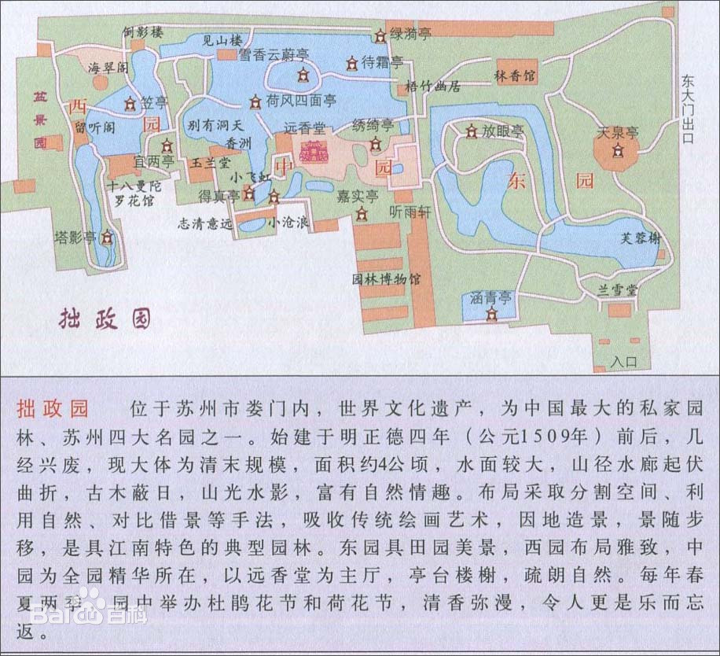
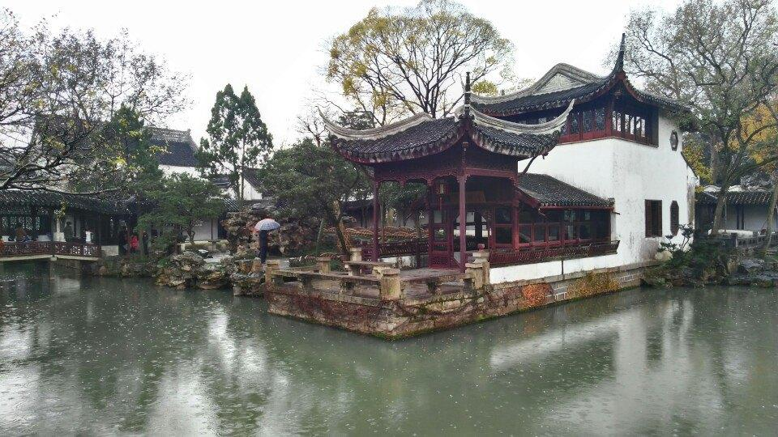
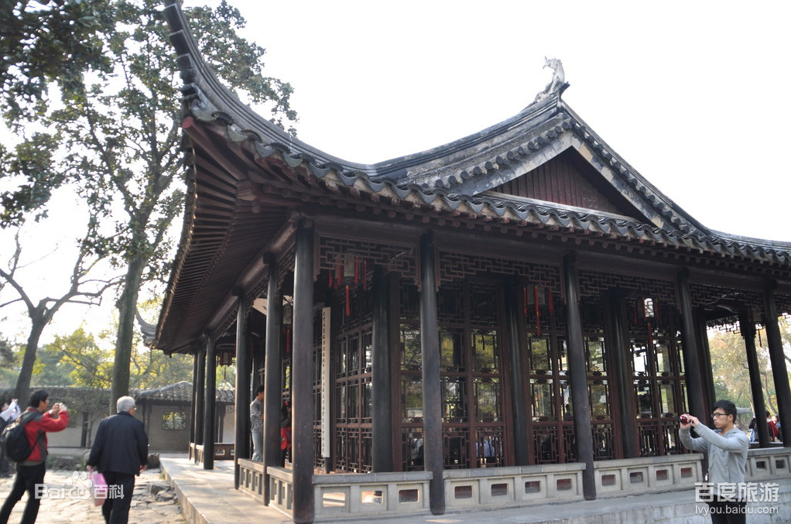
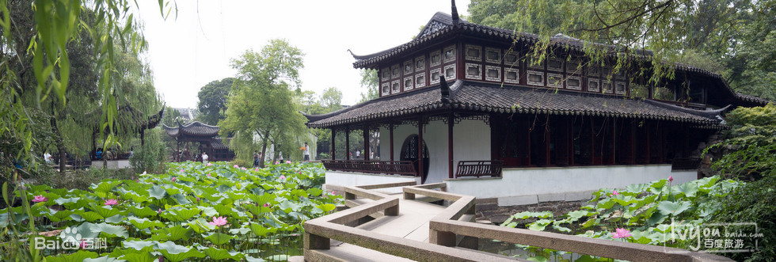
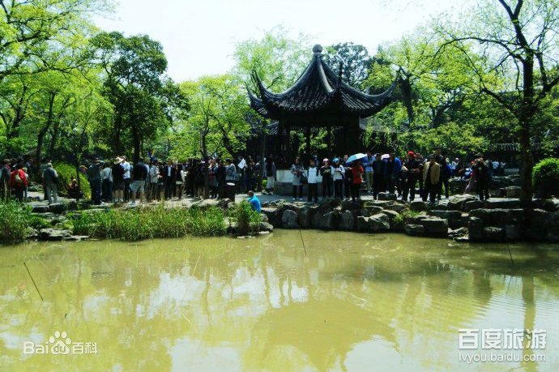
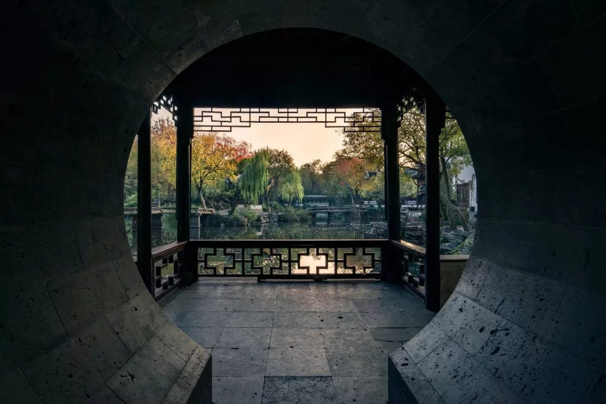
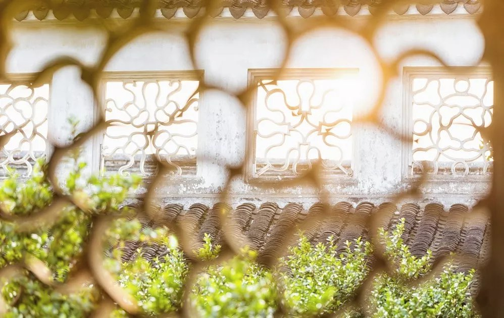
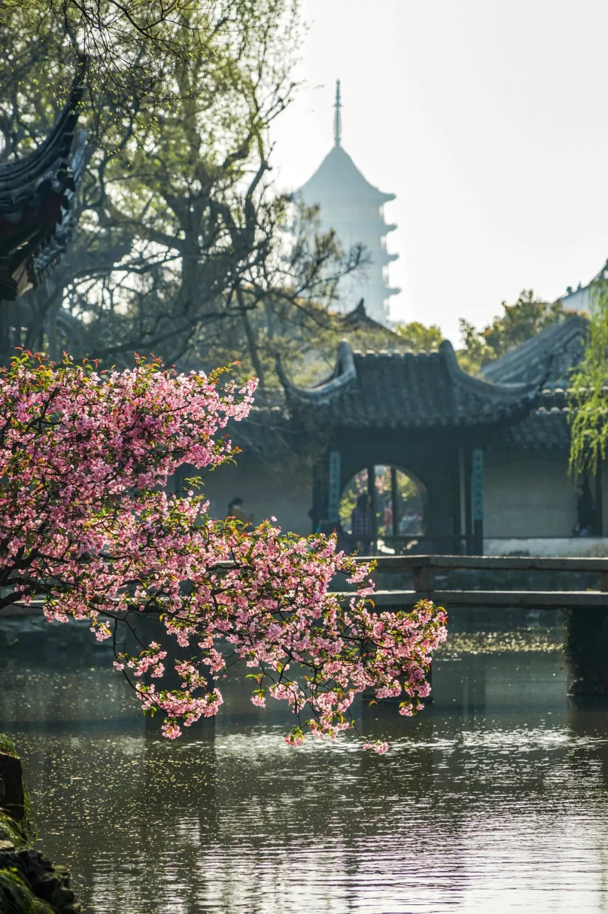
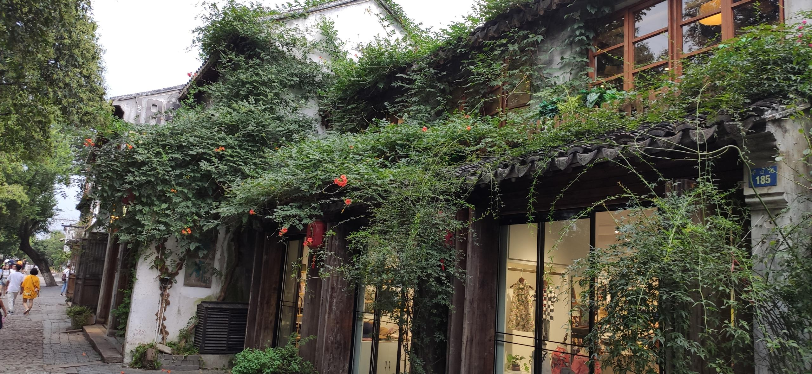

# 拙政园游记

## 前言

游拙政园时，被一个问题--“为什么拙政园是四大名园之一”困在其中，久久未能释怀。

所以，我决定不自量力一番，试图从我自己的视角做些分析。

更详尽的个人想法会写在“初衷”一节。

## 为什么拙政园是四大名园之一

先说说，**什么是景点**?我认为须满足以下某些点：
* 历史价值
* 艺术价值
* 现实价值（环境价值、经济价值）
* 稀有价值

因此，问题是为什么是四大名园之一，我认为要从这两点评价：
历史价值、艺术价值

### 拙政园的历史价值

#### 历史事件摘录

这里不拾人牙慧，直接节录[百度百科](#reference)
> 明正德初年（16世纪初），因官场失意而还乡的御史王献臣，以大弘寺址拓建为园，取晋代潘岳《闲居赋》中“灌园鬻蔬，以供朝夕之膳……此亦拙者之为政也”意，名为“拙政园”。中亘积水，浚治成池，弥漫处“望若湖泊”。园多隙地，缀为花圃、竹丛、果园、桃林，建筑物则稀疏错落，共有堂、楼、亭、轩等三十一景，形成一个以水为主、疏朗平淡，近乎自然风景的园林，“广袤二百余亩，茂树曲池，胜甲吴下”。嘉靖十二年（1533），文徵明依园中景物绘图三十一幅，各系以诗，并作《王氏拙政园记》。
> 
> 明崇祯四年（1631），园东部荒地十余亩为刑部侍郎王心一购得。王善画山水，悉心经营，布置丘壑，于崇祯八年（1635）落成，名“归田园居”，中有秫香楼、芙蓉榭、泛红轩、兰雪堂、漱石亭、桃花渡、竹香廊、啸月台、紫藤坞、放眼亭诸胜，荷池广四、五亩，墙外别有家田数亩。园中多奇峰，山石仿峨嵋栈道。
>
> 据清雍正六年（1728）沈德潜作的《兰雪堂图记》，当时园中崇楼幽洞、名葩奇木、山禽怪兽，与已荡为丘墟的拙政园中部适成对照。直至道光年间，王氏子孙尚居其地，但已渐荒圮，大部变为菜畦草地。
  在此以前，园主虽屡有变动，但大都仍拙政园之旧。
> 
> 至王永宁则大兴土木，易置丘壑，园的面貌与文徵明图记中所述已大不相同（钱泳《履园丛话》、徐乾学《憺园集》）。
> 
> 二十三年（1684），康熙帝玄烨南巡曾来此园。同年编成的《长洲县志》中写道：“廿年来数易主，虽增葺壮丽，无复昔时山林雅致矣”。
> 
> 乾隆初，园又分为中部的“复园”和西部的“书园”两部份。至此，原来浑然一体、统一规划的拙政园，演变为相互分离、自成格局的三个园林。
>
> 园南的东部花园第宅，其时归部郎潘师益。潘与其子在内营构瑞棠书屋。 咸丰十年（1860）六月二日（旧历四月十三），太平军进驻苏州。太平天国忠王李秀成以拙政园并东面的潘子潘爱轩宅、西面的汪硕甫宅合建忠王府，相传见山楼为其治事之所。
>
> 同治二年（1863），李鸿章占领苏州后，将忠王府作为自己的江苏巡抚行辕，藩臬司也在其中办公。    
>
> 同治十年（1871）冬，南皮张之万（光绪中为大学士）任江苏巡抚时，居拙政园原潘宅房屋内。张能书画，经营修治，渐复旧观。
>
> 光绪二十年（1894）张获得文徵明《王氏拙政园记》石刻碑拓，重摹上石，又得文徵明、沈周遗象，为之建“拜文揖沈之斋”。张氏以巨款经营多年，追求奢丽，部份失去了拙政园疏朗闲适的特点。
>
> 随着以武昌起义为发端的辛亥革命爆发，起义浪潮迅速波及全国各省。江苏巡抚程德全于1911年11月5日宣布独立，自任都督。1911年11月21日，在拙政园成立江苏省议会，原谘议局议员55人到会，程德全亲自莅会，宣布开会宗旨。
>
> 民国十七年（1928）九月与廿三年（1934）十月间，又二度被借作戒烟所。
>
> 民国二十六年（1937）日本侵略军飞机几度轰炸苏州。远香堂受震破损，南轩被焚毁，园内到处亭阁倾圮，枯苇败荷，荒秽不堪。同年冬，吴县警察局以冬防期间，令将城区沿途乞丐拘捕收容，并将奉直会馆作为临时收容所。
>
> 1948年，社会教育学院因校舍不足，又向张氏后人张逸侪租借了西部花园和部分房屋。
>
> 1951年11月，苏州专员公署根据中央关于保护历史文物的一贯指示，将拙政园划归苏南区文物管理委员会管理，专员公署另迁新址。文管部门立即修缮，延请专家名匠，规划整治，山、水、桥、亭、厅、堂、墙、门，务期按原样修复。

简单说说上面，

拙政园命名来由：“灌园鬻蔬，以供朝夕之膳……此亦拙者之为政也”。
这反映一种无奈的淡泊之情（这能引起古时文人的多少共鸣呀）。同时，这也是造园造景传递的思想。
再者，才子文徵明参与造园，两位文人将书画之艺术应用到造园中。
文徵明作《王氏拙政园记》画三十一幅，并赋诗。我认为起了一定文学价值和宣传价值。

紧接着，历代都有文人游历其中并留下他们的作品，不细说。

康熙南巡曾游历拙政园。

同时拙政园也是历史见证者。
作为太平天国忠王府一部分、李鸿章用它来做办公地、辛亥革命后在拙政园成立江苏省议会、曾作为戒烟所、抗日时期经历日本飞机战火损坏等等。
在新中国成立，1951后开始进行修缮。

拙政园经过不同时代的修葺，反映了历史的园林建筑技艺。最后，拙政园（或者说苏州园林）在世界发挥了影响力。
列举两个苏州园林孕育的园艺师们在西方国家的作品：  
[苏州十二位园艺师将赴美国建造“拙政园”](http://www.huaxia.com/sh/shqy/2006/00422555.html)  
[加拿大温哥华逸园](http://www.chinaqw.com/node2/node2796/node2882/node2953/node2963/userobject6ai42370.html)

### 拙政园的艺术价值

我会先孤立地说说拙政园有哪些景观，再结合空间、园林营造、整体设计去谈谈我的理解。  
注：由于我没怎么拍图片，所以图片基本是引用网上，出处列在reference中。

拙政园布局：

#### 景观
园林景观归纳起来可分为:山水、植物、天象自然景观和建筑人文景观。

##### 山  

当属中园的水上两座土间石山。以土为主，石为辅，岸边藤萝密布苇丛环绕，登山路苍翠簇拥，小小石山就让人感受真的登山一样。
为了使假山显得不假，路旁左右苍绿扑眼，山建得不太远（当然这也是"空间有限，因地制宜"这一苏州园林的同有属性所致）。

##### 水  

拙政园池子，水面平静舒朗，水清水底布满水草。

水能反射倒影，所以也有景观营造，拓宽景深的作用。

##### 植物  

摘自百度百科：
> 截至2014年，拙政园仍然保持了以植物景观取胜的传统，荷花、山茶、杜鹃为著名的三大特色花卉。仅中部二十三处景观，百分之八十是以植物为主景的景观。如远香堂、荷风四面亭的荷（“香远益清”，“荷风来四面”）；倚玉轩、玲珑馆的竹（“倚楹碧玉万竿长”，“月光穿竹翠玲珑”）；待霜亭的桔（“洞庭须待满林霜”）；听雨轩的竹、荷、芭蕉（“听雨入秋竹”，“蕉叶半黄荷叶碧，两家秋雨一家声”）；玉兰堂的玉兰（“此生当如玉兰洁”）；雪香云蔚亭的梅（“遥知不是雪，为有暗香来”）；听松风处的松（“风入寒松声自古”），以及海棠春坞的海棠，柳荫路曲的柳，枇杷园、嘉实亭的枇杷，得真亭的松、竹、柏等等。
>

以花木喻人之品格，自古以来都流传着。

##### 天象自然  

天象自然景观指的是，观星观月，听风看雨看雪等。

拙政园中也不少，举例如：听雨轩，荷风四面亭，倒影楼等等。

##### 建筑人文景观  

苏州园林的建筑一般都是为观景服务。如何与自然融合，如何相得益彰，不喧宾夺主是其要点。

1.从作用看，有两个：聚景、点景。

聚景：兰雪堂（观兰）

点景：远香堂（四周荷花环绕，既起了观景作用，也融汇于荷池中，起到点缀作用）。

2.从建筑分类：
亭台楼阁轩榭厅舫廊皆可在拙政园找到。

* 亭：山上的雪香云蔚亭。
  
* 台：香洲前部。

* 楼：见山楼

* 阁：留听阁

* 轩：听雨轩

* 榭：芙蓉榭

* 厅：卅六鸳鸯馆 鸳鸯厅是我国古代私家园林的一种厅堂形式。由南北两厅组成，北为方梁有雕花（记忆中卅六鸳鸯馆的木镂空雕花挺好看，我不懂木艺其中奥妙，只能不明觉厉。。），是男主人会客的地方。南为圆梁，无雕花，北厅地砖也比南厅大，南厅是女主人会客和男主人听音乐的地方。
[中国园林建筑中“厅堂”的种类](https://jingyan.baidu.com/article/b2c186c80b1fb3c46ef6ffcb.html)

* 舫：香洲（图片如下） 像一艘舟船。集亭台楼阁于一体。是我个人挺喜欢的一个拙政园建筑。

对比以上各建筑可发现不同建筑类型的特点。

3.从屋顶看：
我发现只有远香堂和见山楼是歇山顶（这体现了两者在拙政园中的地位），其他为卷棚顶，攒尖顶，悬山顶。

歇山顶：

重檐卷棚顶：

六角攒尖顶：

#### 空间营造

历史变迁，拙政园原有4.1公顷，光绪年间为1.2公顷，现园林面积为2.5公顷(不算售票处、博物馆等)。
原来为一体，现分为三个园。

我的理解，一块土地，需要改造成园林，需要划分观赏路线，需要布置一个个不同的园林基本点--景观，
于其中，最好做到步步有景，这就需要有景观划分和联系的智慧了。

园林的空间变化主要是通过对空间进行分隔与联系的不同处理所造成的。
比如，小飞虹，既划分了景观，也通过镂空的廊而增加了景与景映照的趣味。

由于空间有限，以小见大，先抑后扬的手法，也是苏州园林普遍有采用的手法。

##### 空间整体布局关系

空间整体布局关系体现在观赏路线，苏州园林一般有：
* 呈闭合的、环形的观赏路线
* 贯穿式的观赏路线

拙政园是贯穿式观赏路线，就是以一处地方（远香堂）为进入园林中心点，通过中心点可以通往园林各处景观。

##### 景物与视线的组合

在表现景物造型时，一般以视觉为主。从视觉出发，景物与视线的巧妙组合，通常是采用**对景、敞景、分景、框景、漏景、夹景及借景等**处理方式来实现的。
列举拙政园用到的技巧：
* 对景  
[百度文库|苏州园林“对景”手法在平面图中的组景形式分析：以拙政园为例](https://wenku.baidu.com/view/eaf99f99f46527d3250ce007.html)

* 分景  
比如，景墙的设置。

* 框景

通过门框等方式，使人集中于面前如画的景色中，增加了感染力，同时，起到先抑后扬的作用，
当走过门框，廓然开朗，又是另一番滋味。

 
* 漏景

在拙政园可看到很多漏窗，同时每个漏窗力求不重样，从不同漏窗看出去可能又是另一番感受。

* 借景

摘自百度百科：

> 造园时“借景”远处的北寺塔，让人以为那是园中一部分

## 怎么游拙政园

目前景区入口在东园，我建议在东园进入后，或许你跟着向导游历了一遍，或自己走了一遍。
可考虑再在中园的门口，停轿的地方漫步进入，经过厅，在远香堂驻足一番，接着走走中园。
途中暂时舍弃所有生活顾虑和烦忧，忽略掉所有游人，打开感官（嗅、听、视、触），任由一水一木一花一草映入眼帘，
感受你的感受（是有所共鸣也好，觉得乏味千篇一律也好）。

## 初衷（为什么写）

进院后，“为什么拙政园是四大名园之一”这问题一直萦绕在我脑海，使我难受极了，
逛了一圈后，我咨询了工作人员，希望有人可以分析拙政园一砖一瓦之精髓，未得到理想答案。
于是，我停下来，网上翻了一阵资料，从中园离开了。
这是我写这篇文章的初衷，
可是回来后看了一些资料，又看了《苏州园林》、《中国建筑史》、《穿墙透壁》后，
我问，那我当时游拙政园的感受是怎样的呢？
没有，我答。我发现，我没有好好感受拙政园。

无论是想象自己竟然和几百年前的故人在踏足同一块土地看同一杨景色，还是放松自己不去想别的尽情捕捉景色之美。我觉得游拙政园，想做功课就事前做，游玩途中尽情感受当下，尽兴而归（这和我旅途中思考的拍照的意义相似）。
所以我在上面写到“感受你的感受”，才不枉费苏州园林的“意”和“境”。
像我纠结于这是什么木材，什么景，纠结于从哪里看景色好，分毫不差的打卡位，我个人认为那是舍本逐末之做法。

所以我上面写到，再游一遍我会怎么游拙政园。

## 苏州印象

苏州给我留下了深刻印象。说下流水账，

我住在观前街边上，我到的那天晚上刚好七夕，我停好车发现我面前断续走过是5~10对俊男美女，
令人惊讶是，他们都好高，男的都比我高（>180cm），难道苏州人都比较高？

隔天，在我离开拙政园后，在观前街那一带走了一段，发现建筑（无论民居还是商铺）风格好统一，白墙灰瓦，文化在传承着。  
不少商铺会自己种些植物打理着：

也看到一些寻常百姓家中的天井，营造起自己的假山植栽。

我向一位老爷爷问起路，他温和地解答着，还找街坊帮忙指引我。
回酒店路上我看到一位出门遛一只小黄狗的老爷爷，好奇问起他：像这一带建筑都像古时建筑，都是木头建的吗？
他不紧不慢的跟我说起这些建筑。结论是，基本都是水泥钢筋做的，
不过，他指向一个在施工中的建筑木架子，说，那个就是木做的，是古建，造起来比较贵。

我发现，他们不同于我途中看到的乐观的西藏人爽朗的西安人等，说不定如《苏州园林》说，苏州人有温柔细腻的群体性格吧。

## reference

[1]苏州园林设计院.苏州园林.中国:中国建筑工业出版社,1999  
[2]李乾朗.穿墙透壁.中国:广西师范大学出版社,2009  
[3]梁思成.中国建筑史.中国:生活·读书·新知三联书店,2011  
[4][马蜂窝|这是一份价值一千元的拙政园旅行指南](http://www.mafengwo.cn/gonglve/ziyouxing/254713.html)  
[5][百度百科|拙政园][link:5]  
[6][百度百科|500年苏州拙政园，无人能懂](https://wapbaike.baidu.com/tashuo/browse/content?id=1275b5b5f4a2f353007f16df)  
[7][知乎|杭州象内设计|中国.设计 | 解析古建筑屋顶的种类，学问居然这么大？！](https://zhuanlan.zhihu.com/p/74962304)  
[8][拙政园——香洲](https://www.ddove.com/htmldata/20061213/b200344730b7d984.html)  
[9][百度文库|苏州园林“对景”手法在平面图中的组景形式分析：以拙政园为例](https://wenku.baidu.com/view/eaf99f99f46527d3250ce007.html)  
[10][苏州十二位园艺师将赴美国建造“拙政园”](http://www.huaxia.com/sh/shqy/2006/00422555.html)  
[11][加拿大温哥华逸园](http://www.chinaqw.com/node2/node2796/node2882/node2953/node2963/userobject6ai42370.html)  

另，觉得这篇文章拍的照挺好看，mark：
[花菜阿良|中国四大园林之首拙政园，你看懂了多少？](https://mp.weixin.qq.com/s?__biz=MzAxNzM2MjcyMg==&mid=2247486614&idx=1&sn=243ac09cd69d154007b732f3b9dbb8a2&chksm=9be7f6dbac907fcd0ad0aac66b0201c44e361c214f4e415351e29dd6f36dfc59ee9cfbb9354b&token=2068481580&lang=zh_CN#rd)

[link:5]: https://baike.baidu.com/item/%E6%8B%99%E6%94%BF%E5%9B%AD